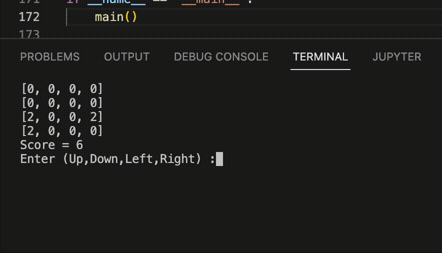

# 2048

## Project 2 for CPSC 335

Team 2048

**The goal of the game** is to combine tiles with the same number to create a tile with a larger number. The game is won when the player reaches the 2048 tile, and the game is lost when there are no more moves to make.

## Functions

### `__init__(self)`
- Takes in: `self`
- Returns: `None`
- Initializes the game board, adds two random tiles, sets the game state to playing, and initializes the score to 0.

### `new_title(self)`
- Takes in: `self`
- Returns: `None`
- Finds all empty tiles on the board and adds a new tile (either 2 or 4) to a randomly chosen empty tile.

### `move(self, direction)`
- Takes in: `self`, `direction` (str)
- Returns: `None`
- Updates the board and score according to the player's move in the given direction, adds a new tile, and checks if the game is over.

### `is_game_over(self)`
- Takes in: `self`
- Returns: `bool`
- Checks if there are any empty tiles or adjacent tiles with the same value. If there are no more moves available, returns `True`. Otherwise, returns `False`.

### `print_board(self)`
- Takes in: `self`
- Returns: `None`
- Prints the current state of the game board.

### `get_score(self)`
- Takes in: `self`
- Returns: `None`
- Calculates the score by adding up the values of all tiles on the board and updates the score attribute.

### `main()`
- Takes in: `None`
- Returns: `None`
- Main function that initializes the game, takes user input for moves, updates the game state, and prints the final score when the game is over.
